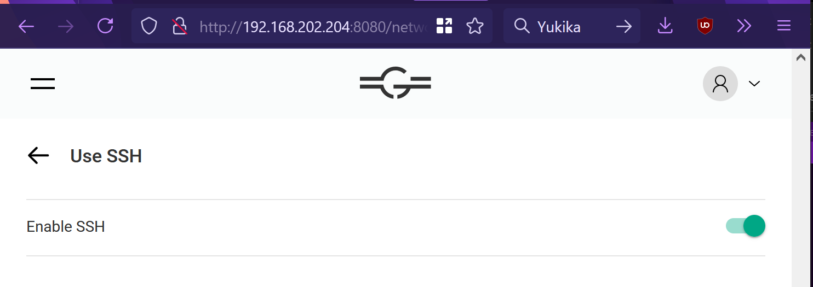

# GHubDiag.sh

This article applies to the following installations:
|Host OS|Gravio Version||
|----------|:-------------:|------:|
|Linux-based|Any|


## Pre-Requisites
Make sure that SSH is enabled for this Gravio Hub by logging into the Update Manager at (http://example:8080) and scrolling down to the SSH settings menu:



And ensuring that SSH is switched on.

## Installation

1. SSH into the machine
    ```bash
    addr="192.168.200.204"
    ssh gravio@$addr
    ```
2. create a directory for the script
    ```
    mkdir diag
    cd diag
    ```

3.  Install Script (choose one, not both)

    A. Download via GitHub: 
    ```bash
    wget https://raw.githubusercontent.com/0xNF/GravioUtils/master/lin/scripts/ghubdiag.sh
    ```
    B. SCP script locally  
    1.  Exit the ssh session:
        ```bash
        exit
        ```
    1. Find your local copy of the script and scp it into the GHub:
        ```powershell
        scp ./ghubdiag.sh gravio@$addr:~/diag/
        ```

4. Once the script is on the machine, set the execution permission:
    ```bash
    chmod +x ~/diag/ghubdiag.sh
    ```
    
4. Then, set the Cron schedule for it:
    ```bash
    sudo su
    (crontab -l ; echo "*/10 * * * * /home/gravio/diag/ghubdiag.sh")| crontab -
    exit
    ```
    This sets it to run every 10 minutes.

    A. you may see `no crontab for root` written to the console. This is _not a problem_. It just means that before this command no crontab file existed for the user, but there is one now.

    B. confirm that the line appears in crontab:
    ```bash
    sudo crontab -l | grep ghubdiag.sh
    ```
    The following highlighted output should be printed to the console:  
    `*/10 * * * * /home/gravio/diag/ghubdiag.sh`
    
    
5. Every 10 minutes a new log folder should be written to the location `/var/log/graviohub/`

## Output

The file creates a folder, located at `/var/log/graviohub` with the following contents:
```
cpu.log
docker.log
net.log
```

cpu.log contains `ps` and `top` information, docker.log contains information about the running docker containers used by Gravio, and net.log contains info about the active Network Interfaces.

All of this information may be useful to Gravio Customer Support.


## Downloading to your computer

### Grab all the folders created:
`scp -r gravio@$addr /var/log/graviohub/ ./`

### Grab only the date you want
Date formats are in `YYYYMMDD`, for instance,   
1. October 14, 2020 == `20201014`  
1. July 09, 2020 == `20210709`

Take the date you want and add it to the scp command:

`scp -r gravio@$addr /var/log/graviohub/20210709 ./`